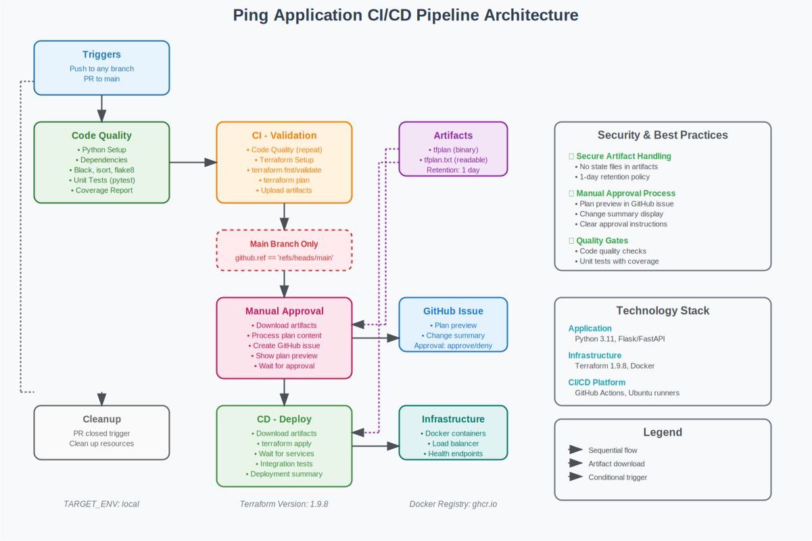

# Ping Application - Tech Interview Project

A scalable web application demonstrating containerization, infrastructure as code, load balancing, and CI/CD best practices.

## 🏗️ Architecture Overview

```
Internet → Load Balancer (Nginx) → Application Nodes (Flask)
           ↓                        ↓
         Port 8080               Ports 5000-500X
         (HTTP/HTTPS)           (Internal Network)
```

## 📋 Project Structure

```
.
├── app.py                  # Flask application
├── requirements.txt        # Python dependencies
├── Dockerfile             # Container configuration
├── main.tf                # Terraform main configuration
├── variables.tf           # Terraform variables
├── outputs.tf             # Terraform outputs
├── nginx.conf.tpl         # Nginx configuration template
├── load_test.py           # Load testing script
├── .github/workflows/    # CI/CD pipeline
└── README.md             # This file
```

## 🚀 Quick Start

### Prerequisites

- Docker and Docker Compose
- Terraform >= 1.0
- Python 3.11+

### 1. Local Development

```bash
# Install dependencies
pip install -r requirements.txt

# Run locally
python app.py

# Test the endpoint
curl http://localhost:5000/api/ping
```

### 2. Docker Deployment

```bash
# Build image
docker build -t ping-app:latest .

# Run container
docker run -p 5000:5000 ping-app:latest
```

### 3. Infrastructure Deployment

````bash
# Initialize Terraform
terraform init

# Plan deployment (3 nodes by default)
terraform plan

# Deploy infrastructure
terraform apply

# Test load balancer (TLS Enabled - it can be managed via the enable_tls toggle - set to true by default in variables.tf)
curl -k https://localhost:8080/api/ping

## 🔧 Configuration Options

### Terraform Variables

| Variable | Description | Default | Valid Range |
|----------|-------------|---------|-------------|
| `node_count` | Number of application nodes | 3 | 1-10 |
| `lb_port` | Load balancer external port | 8080 | 1001-65535 |
| `enable_tls` | Enable TLS/HTTPS | false | true/false |

### Environment Variables

| Variable | Description | Default |
|----------|-------------|---------|
| `FLASK_HOST` | Flask bind address | 0.0.0.0 |
| `FLASK_PORT` | Flask port | 5000 |
| `FLASK_DEBUG` | Debug mode | False |

## 🧪 Testing

### Unit Tests

```bash
# Run tests with coverage
pytest --cov=app --cov-report=term-missing

# Run linting
flake8 app.py
black --check app.py

## 🔒 Security Features

### Application Security
- Non-root user in container
- Health check endpoints
- Input validation
- Error handling
- Security headers

### Infrastructure Security
- TLS encryption (optional - enabled by default)
- Rate limiting
- Network isolation
- Container resource limits
- Security scanning in CI/CD

### TLS Configuration

When `enable_tls=true`:
- Self-signed certificates generated
- HTTPS on port 443/8443
- HTTP redirects to HTTPS
- Strict transport security headers

## 📊 Monitoring & Observability

### Health Checks

```bash
# Load balancer health
curl -k https://localhost:8080/health

# Application health
curl http://localhost:5000/health
````

### Container Monitoring

````bash
# View container status
docker ps --filter "label=app=ping-service"

# View logs
docker logs ping-app-lb -f

# Resource usage
docker stats

## 🔄 CI/CD Pipeline

### Pipeline Stages

1. **Build & Test**
   - Code linting (black, flake8)
   - Unit tests with coverage

2. **Infrastructure Validation**
   - Terraform format check
   - Terraform validation

3. **Deployment**
   - From the main branch

4. **Testing**
   - Integration tests
   - Health checks

### GitHub Actions Workflow

```yaml
# Triggers
on:
  push:
    branches: [ main ]
  pull_request:
    branches: [ main ]
````

### Pipeline Features

- ✅ Automated testing
- ✅ Blue-green deployment ready
- ✅ Rollback capabilities

## 🚀 Deployment Strategies

### Custom Deployment

```bash
terraform apply \
  -var="node_count=7" \
  -var="lb_port=9000" \
  -var="enable_tls=true"
```

## 🔧 Troubleshooting

### Common Issues

**1. Port Already in Use**

```bash
# Find process using port
lsof -i :8080

# Change port
terraform apply -var="lb_port=8081"
```

**2. Docker Permission Denied**

```bash
# Add user to docker group
sudo usermod -aG docker $USER
# Logout and login again
```

**3. TLS Certificate Issues**

```bash
# Test with curl ignoring SSL
curl -k https://localhost:8080/api/ping
```

**4. Container Health Check Failures**

```bash
# Check container logs
docker logs ping-app-node-1

# Check network connectivity
docker exec ping-app-lb ping ping-app-node-1
```

## 📈 Scaling Considerations

### Horizontal Scaling

```bash
# Scale up nodes
terraform apply -var="node_count=10"
```

### Load Balancer Configuration

- **Algorithm**: Least connections
- **Health Checks**: Every 30 seconds
- **Failover**: Automatic
- **Session Persistence**: None (stateless)

### Performance Tuning

- **Gunicorn Workers**: 2 per container
- **Connection Timeout**: 30 seconds
- **Rate Limiting**: 10 req/sec per IP
- **Resource Limits**: 256MB memory per container

## 🚨 Emergency Procedures

### Rollback Deployment

```bash
# Manual rollback
terraform destroy -auto-approve
terraform apply -auto-approve -var="node_count=1"
```

### Scale Down

```bash
# Reduce to minimum
terraform apply -var="node_count=1"
```

### Health Recovery

```bash
# Restart all containers
docker restart $(docker ps -q --filter "label=app=ping-service")
```

## 📝 API Documentation

### Endpoints

#### GET /api/ping

Returns pong message with hostname.

**Response:**

```json
{
  "message": "pong",
  "hostname": "<node_name>"
}
```

#### GET /health

Health check endpoint.

**Response:**

```json
{
  "status": "healthy"
}
```

## 📚 Additional Resources

- [Flask Documentation](https://flask.palletsprojects.com/)
- [Docker Best Practices](https://docs.docker.com/develop/dev-best-practices/)
- [Terraform Documentation](https://www.terraform.io/docs)
- [Nginx Configuration](https://nginx.org/en/docs/)
- [GitHub Actions](https://docs.github.com/en/actions)

## 🤝 Contributing

1. Fork the repository
2. Create feature branch (`git checkout -b feature/amazing-feature`)
3. Commit changes (`git commit -m 'Add amazing feature'`)
4. Push to branch (`git push origin feature/amazing-feature`)
5. Open Pull Request

## 📄 License

This project is created for educational/interview purposes.

## 🏗️ CI/CD Architecture



### Pipeline Overview

Our CI/CD pipeline implements a secure, multi-stage deployment process with the following key features:

- **Automated Quality Gates**: Code quality checks, linting, and unit testing
- **Infrastructure as Code**: Terraform validation and planning
- **Manual Approval Process**: GitHub issue-based approval with plan preview
- **Secure Artifact Management**: No sensitive state files in artifacts
- **Conditional Deployment**: Main branch protection with approval gates

### Key Benefits

- ✅ **Security First**: No state files exposed, manual approval required
- ✅ **Quality Assurance**: Automated testing and code quality checks
- ✅ **Transparency**: Full Terraform plan visible during approval
- ✅ **Auditability**: Complete history of approvals and deployments

## 🚀 Load Testing script usage examples:

```
python load_test.py
```

# Custom number of requests

```
python load_test.py --requests 200
```

# Custom URL and requests

```
python load_test.py --url https://localhost:8443/api/ping --requests 150
```

# With timeout setting

```
python load_test.py --requests 100 --timeout 15
📊 Sample Output:
🚀 Starting load test...
Target URL: https://localhost:8080/api/ping
Total Requests: 100


---

Progress: 10/100 requests...
Progress: 20/100 requests...
...
✅ Load test completed!

============================================================
ALCATRAZ AI LOAD TEST RESULTS
============================================================
Total Requests: 100
Successful Requests: 100
Failed Requests: 0
Success Rate: 100.0%

## 📋 LIST OF NODE HOSTNAMES:

Node Hostnames: 09dd8dd1d425, 3326e86ad54f, a346185cf877

## 🔢 COUNT OF AVAILABLE NODES:

Available Nodes: 3

## 📊 REQUESTS HANDLED BY EACH NODE:

09dd8dd1d425: 34 requests (34.0%)
3326e86ad54f: 33 requests (33.0%)
a346185cf877: 33 requests (33.0%)

============================================================
✅ ALCATRAZ AI REQUIREMENTS COMPLETED:
✓ List of node hostnames
✓ Number of requests handled by each node
✓ Count of available nodes
============================================================
```

<!-- BEGIN_TF_DOCS -->
## Requirements

| Name | Version |
|------|---------|
| <a name="requirement_terraform"></a> [terraform](#requirement\_terraform) | >= 1.0 |
| <a name="requirement_docker"></a> [docker](#requirement\_docker) | ~> 3.0 |
| <a name="requirement_tls"></a> [tls](#requirement\_tls) | ~> 4.0 |

## Providers

| Name | Version |
|------|---------|
| <a name="provider_docker"></a> [docker](#provider\_docker) | 3.6.2 |
| <a name="provider_tls"></a> [tls](#provider\_tls) | 4.1.0 |

## Modules

No modules.

## Resources

| Name | Type |
|------|------|
| [docker_container.app_nodes](https://registry.terraform.io/providers/kreuzwerker/docker/latest/docs/resources/container) | resource |
| [docker_container.load_balancer](https://registry.terraform.io/providers/kreuzwerker/docker/latest/docs/resources/container) | resource |
| [docker_image.nginx](https://registry.terraform.io/providers/kreuzwerker/docker/latest/docs/resources/image) | resource |
| [docker_image.ping_app](https://registry.terraform.io/providers/kreuzwerker/docker/latest/docs/resources/image) | resource |
| [docker_network.app_network](https://registry.terraform.io/providers/kreuzwerker/docker/latest/docs/resources/network) | resource |
| [tls_private_key.internal_ca](https://registry.terraform.io/providers/hashicorp/tls/latest/docs/resources/private_key) | resource |
| [tls_self_signed_cert.internal_ca](https://registry.terraform.io/providers/hashicorp/tls/latest/docs/resources/self_signed_cert) | resource |

## Inputs

| Name | Description | Type | Default | Required |
|------|-------------|------|---------|:--------:|
| <a name="input_app_name"></a> [app\_name](#input\_app\_name) | Name of the application (used for naming resources) | `string` | `"ping-app"` | no |
| <a name="input_app_port"></a> [app\_port](#input\_app\_port) | Internal port for the application containers | `number` | `5000` | no |
| <a name="input_app_version"></a> [app\_version](#input\_app\_version) | Version tag for the application | `string` | `"latest"` | no |
| <a name="input_container_memory"></a> [container\_memory](#input\_container\_memory) | Memory limit for application containers (MB) | `number` | `256` | no |
| <a name="input_container_memory_swap"></a> [container\_memory\_swap](#input\_container\_memory\_swap) | Memory swap limit for application containers (MB) | `number` | `512` | no |
| <a name="input_docker_build_no_cache"></a> [docker\_build\_no\_cache](#input\_docker\_build\_no\_cache) | Force Docker build without cache | `bool` | `false` | no |
| <a name="input_enable_detailed_logging"></a> [enable\_detailed\_logging](#input\_enable\_detailed\_logging) | Enable detailed application logging | `bool` | `false` | no |
| <a name="input_enable_security_headers"></a> [enable\_security\_headers](#input\_enable\_security\_headers) | Enable security headers in Nginx | `bool` | `true` | no |
| <a name="input_enable_tls"></a> [enable\_tls](#input\_enable\_tls) | Enable TLS/HTTPS for the load balancer | `bool` | `true` | no |
| <a name="input_gunicorn_timeout"></a> [gunicorn\_timeout](#input\_gunicorn\_timeout) | Gunicorn worker timeout in seconds | `number` | `30` | no |
| <a name="input_gunicorn_workers"></a> [gunicorn\_workers](#input\_gunicorn\_workers) | Number of Gunicorn worker processes per container | `number` | `2` | no |
| <a name="input_health_check_interval"></a> [health\_check\_interval](#input\_health\_check\_interval) | Health check interval in seconds | `number` | `30` | no |
| <a name="input_health_check_retries"></a> [health\_check\_retries](#input\_health\_check\_retries) | Number of health check retries before marking unhealthy | `number` | `3` | no |
| <a name="input_health_check_start_period"></a> [health\_check\_start\_period](#input\_health\_check\_start\_period) | Health check start period in seconds | `number` | `15` | no |
| <a name="input_health_check_timeout"></a> [health\_check\_timeout](#input\_health\_check\_timeout) | Health check timeout in seconds | `number` | `10` | no |
| <a name="input_lb_port"></a> [lb\_port](#input\_lb\_port) | External port for the load balancer | `number` | `8080` | no |
| <a name="input_log_level"></a> [log\_level](#input\_log\_level) | Application log level | `string` | `"INFO"` | no |
| <a name="input_network_subnet"></a> [network\_subnet](#input\_network\_subnet) | CIDR subnet for the application network | `string` | `"172.20.0.0/16"` | no |
| <a name="input_nginx_worker_connections"></a> [nginx\_worker\_connections](#input\_nginx\_worker\_connections) | Number of worker connections for Nginx | `number` | `1024` | no |
| <a name="input_node_count"></a> [node\_count](#input\_node\_count) | Number of application nodes to deploy | `number` | `3` | no |
| <a name="input_rate_limit_burst"></a> [rate\_limit\_burst](#input\_rate\_limit\_burst) | Rate limit burst size | `number` | `20` | no |
| <a name="input_rate_limit_requests"></a> [rate\_limit\_requests](#input\_rate\_limit\_requests) | Rate limit requests per second per IP | `number` | `10` | no |
| <a name="input_rebuild_trigger_files"></a> [rebuild\_trigger\_files](#input\_rebuild\_trigger\_files) | List of files that should trigger Docker image rebuilds | `list(string)` | <pre>[<br/>  "Dockerfile",<br/>  "app.py",<br/>  "requirements.txt"<br/>]</pre> | no |
| <a name="input_ssl_protocols"></a> [ssl\_protocols](#input\_ssl\_protocols) | Allowed SSL/TLS protocols | `list(string)` | <pre>[<br/>  "TLSv1.2",<br/>  "TLSv1.3"<br/>]</pre> | no |
| <a name="input_tags"></a> [tags](#input\_tags) | Tags to apply to all resources | `map(string)` | <pre>{<br/>  "ManagedBy": "terraform",<br/>  "Owner": "givanov-devops",<br/>  "Project": "ping-application"<br/>}</pre> | no |

## Outputs

| Name | Description |
|------|-------------|
| <a name="output_app_nodes"></a> [app\_nodes](#output\_app\_nodes) | List of application node details |
| <a name="output_application_info"></a> [application\_info](#output\_application\_info) | Application deployment information |
| <a name="output_build_information"></a> [build\_information](#output\_build\_information) | Docker image build information |
| <a name="output_container_configuration"></a> [container\_configuration](#output\_container\_configuration) | Container configuration summary |
| <a name="output_deployment_summary"></a> [deployment\_summary](#output\_deployment\_summary) | Complete deployment summary |
| <a name="output_load_balancer_health_url"></a> [load\_balancer\_health\_url](#output\_load\_balancer\_health\_url) | Load balancer health check URL |
| <a name="output_load_balancer_url"></a> [load\_balancer\_url](#output\_load\_balancer\_url) | URL of the load balancer |
| <a name="output_monitoring_endpoints"></a> [monitoring\_endpoints](#output\_monitoring\_endpoints) | Available monitoring and health check endpoints |
| <a name="output_network_info"></a> [network\_info](#output\_network\_info) | Network configuration details |
| <a name="output_resource_tags"></a> [resource\_tags](#output\_resource\_tags) | Applied resource tags |
| <a name="output_security_configuration"></a> [security\_configuration](#output\_security\_configuration) | Security settings summary |
<!-- END_TF_DOCS -->
